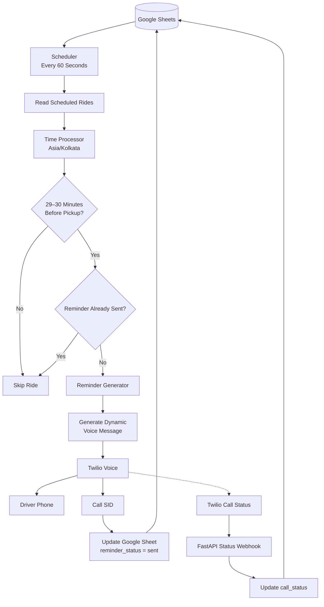

# Driver Pickup Reminder Agent

The Driver Pickup Reminder Agent automatically checks scheduled rides from Google Sheets and reminds drivers approximately 30 minutes before pickup through a Twilio voice call. It ensures reliable, duplicate-free execution via a simplified local background scheduler.

## Architecture


## Features
- **Google Sheet Integration:** Reads and mutates states directly in real-time.
- **30-Minute Reminder Detection:** Evaluates rides based on a mathematically precise inclusive trigger window (29-30 minutes out).
- **Dynamic Voice Message:** Safely parses ride context (driver, pickup location, time) into natural Twilio text-to-speech.
- **Twilio Integration:** Outbound SIP calls handled securely.
- **Duplicate Prevention:** Tracks `sent` statuses to rigidly avoid re-dispatching reminders in subsequent scheduler loops.
- **Call Status Tracking:** FastAPI webhook handles Twilio API asynchronous outcomes (e.g., answered, no-answer, busy).
- **Mock Twilio Mode:** Local bypass testing mode ensures development loops don't incur corporate telecom API costs.
- **Error Handling:** Robust exception boundaries guarantee the master scheduler sequence continues firing cleanly upon external API outages.

## Tech Stack


## Google Sheet Format
Ensure your connected Google Sheet contains the following exact headers for compatibility:
```text
driver_name
driver_phone
pickup_location
scheduled_pickup_time
reminder_status
call_status
call_sid
reminder_sent_at
```
*Note: `scheduled_pickup_time` expects standard YYYY-MM-DD HH:MM:SS format.*

## Environment Variables
Reference `.env.example` to construct your `.env` configuration file securely:

```env
TWILIO_ACCOUNT_SID=
TWILIO_AUTH_TOKEN=
TWILIO_PHONE_NUMBER=
GOOGLE_SHEET_ID=
GOOGLE_SHEET_NAME=
GOOGLE_CREDENTIALS_FILE=
TIMEZONE=Asia/Kolkata
STATUS_CALLBACK_URL=
TEST_PHONE_NUMBER=
MOCK_TWILIO=true
```

## Setup
```bash
git clone <repo-url>
cd driver-pickup-reminder
python3 -m venv venv
source venv/bin/activate
pip install -r requirements.txt
```
1. Create your `.env` and fill in credentials.
2. Ensure you have authorized the Google Service Account JSON to have editor access on your Google Sheet.

## Running the Scheduler
Start the active automation loop that strictly evaluates the Google Sheet every 60 seconds:
```bash
python -m app.scheduler
```

## Mock Mode
Set the environment variable:
```env
MOCK_TWILIO=true
```
When enabled, the system cleanly bypasses Twilio outbound SIP signaling. A mock SID is generated instead, preserving API credit balances while allowing full end-to-end local status updates inside the Live Google Sheet.

## Webhook
The FastAPI architecture automatically binds a `POST /twilio/status` webhook endpoint locally. It securely accepts incoming Twilio form updates mapping the `CallSid` natively back to the sheet's `call_status` column. 

*To expose this locally to the public Twilio APIs, consider leveraging Ngrok or deploy this FastAPI container to your VPC.*

## Testing
To run the deterministic edge case mock suite:
```bash
pytest test/
```

## Demo
To manually demo the system lifecycle:
1. Ensure `MOCK_TWILIO=true` in `.env`.
2. Add a test ride to the Google Sheet.
3. Set the `scheduled_pickup_time` exactly 29-30 minutes away from your active system clock.
4. Set `reminder_status = pending`.
5. Execute `python -m app.scheduler`.
6. Observe the terminal correctly logging detection, mock SID generation, and the Google Sheet cell auto-updating.
7. Rerun the cycle natively to observe the "duplicate skip" functionality block subsequent calls gracefully.
*Note: Twilio production verification is currently pending company-provided credentials. For final verification, set `MOCK_TWILIO=false`.*

## Known Limitations & V2 Improvements
The following architectures were explicitly omitted from the scope of v1 to keep the initial deployment maximally lightweight:
- **Missing Reliability Locking:** State mutations operate sequentially. A network outage midway could leave `call_sid` orphaned from a successful Twilio hook. 
- **No Production Secrets Protection:** Twilio Webhook Request Validation algorithms are bypassed in v1. 

## V2 Roadmap

The current implementation intentionally keeps the system lightweight and focused on
the core reminder workflow. With additional development time, the following
improvements could make it more reliable, scalable, and operationally useful.

| Area | Enhancement | Benefit |
|---|---|---|
| 📍 **Driver Tracking** | Live GPS & location polling | Detect whether the driver is actually moving toward the pickup location |
| 🕐 **Smart Reminders** | ETA-based reminder timing | Trigger reminders based on actual arrival estimates instead of a fixed 30-minute window |
| 🔄 **Reliability** | Retry & escalation workflow | Automatically retry failed calls and notify the fleet manager when necessary |
| 📱 **Communication** | SMS fallback | Send the reminder through SMS when a voice call is unanswered or fails |
| 🗄️ **Data Layer** | PostgreSQL-backed state management | Provide more reliable persistence and structured ride/call history |
| 🔒 **Concurrency** | Database/distributed locking | Prevent duplicate reminders when multiple scheduler instances run simultaneously |
| ⚙️ **Scalability** | Task queues with Celery/RabbitMQ | Support higher ride volumes and distributed background processing |
| 🔐 **Security** | Twilio webhook signature validation | Ensure status callbacks genuinely originate from Twilio |
| 📊 **Operations** | Admin dashboard | Give fleet managers visibility into rides, reminders, call outcomes, and failures |
